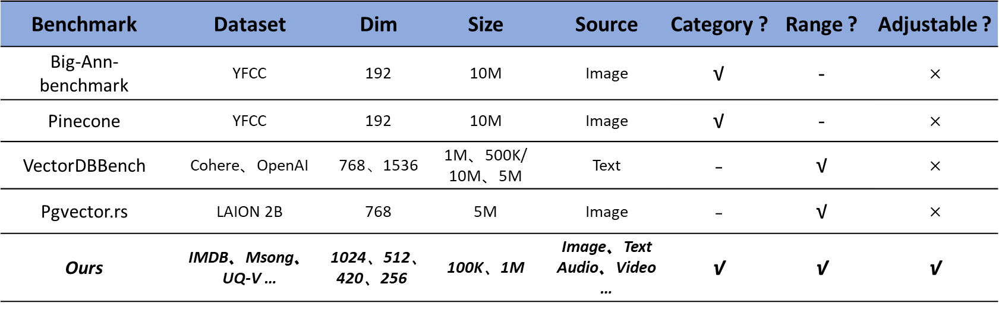

# VecBench: A reliable and customizable Benchmark Tool

## VecBench Introduction
#### Hybrid search benchmark comparison:
  


--- 
#### Overview:
**Dataset:** IMDB(Image+Text)、Msong(Audio)、UQ-V(Video)
**Adjustable:** Vector data dimensions and dataset sizes can be adjusted.
**Workload:** Index building and Hybrid search in static scenarios.
(Focus on query correlation、filtering rate …)
**Metric:** Time of Index Construction、Latency、Recall 
**Database:** pgvector、milvus

---

#### Advantages:
Key Advantages of Our Vector Benchmark Tool:
**1. Real-world Query Simulation​
Our query design combines ​categorization queries​ and ​range queries, accurately replicating real-world application scenarios to ensure practical relevance.**

**2. Adaptive Hybrid Query Strategy​
To address limitations of traditional pre-/post-filtering approaches, we developed a ​cardinality estimation-based strategy​ that dynamically selects optimal query execution plans based on contextual parameters.**

**3. Dimension-Scale Agnostic Control​
Users can:
Continuously adjust vector dimensions (with guaranteed top-k consistency across dimensional changes)
Scale dataset sizes (while preserving original data distribution characteristics)
This enables flexible yet consistent benchmarking across configurations.**
<!--Windows + PostgreSQL 16.1 + pgvector 0.7.3-->

--- 
### Prerequisites
- Python 3.8+ (Recommended to use a virtual environment：`python -m venv venv`)
- PostgreSQL 16.1+ (pgvector requires manual installation)
- Docker (If using Milvus)

### Install
```shell
pip install -r requirements.txt
```
### Start

##### **Step 0. Check the database configuration and environment**
Current supported databases:
 - ​**pgvector​
✅ ​Verified deployment mode**：

Sever-side：Windows running PostgreSQL（requires installation [pgvector extension](https://github.com/pgvector/pgvector)）
Client-side：Benchmarking tool can be run on Windows/Linux (only network connection required)
📝 Recommended use cases: lightweight vector retrieval, integration scenarios with existing PostgreSQL ecosystem
 - ​**Milvus​
✅ ​Verified deployment mode**：

Sever-side：Recommended Docker deployment​（[quick setup guide](https://milvus.io/docs/zh/install_standalone-docker.md)）
Client-side：Cross-platform support（Windows/Linux/macOS）
📝 Recommended use cases: large-scale vector retrieval, distributed scenarios, high throughput and low latency requirements

 - **Request more database support?**
🔧 If you need the following support, please raise your request in Issues:
   - Add new database types​ (such as Elasticsearch, Qdrant, Weaviate, etc.)
   - Other deployment modes​ (for example, pgvector on Linux server, Milvus on Kubernetes cluster)
   - Specific environment adaptation​ (such as ARM architecture, cloud-hosted services, etc.)


##### **Step 1. Configure Database Connection Information:**
Configure the database connection information in `db_config.yaml`, including the database type, database address, database port, database name, username, and password.

##### **Step 2. Parameter Settings:**
Determine the parameters you need to set. You can adjust them via command-line arguments or configure them in a yaml file. For more details, see [Notes](#notes).

##### **Step 3. Initialization and Test Execution:**


``` shell
python benchmark.py --operation init 
# The init phase creates tables, inserts the dataset into the database, and generates ground truth based on the designed queries. In principle, if the queries do not change, there is no need to regenerate them every time.

python benchmark.py --operation run --algorithm ivfflat --times 10 

# During the run phase, tests are conducted using different index types and the results are evaluated.
# Parameter details:
# Different index types (related parameters use default values)  --algorithm ivfflat/hnsw
# Number of times each query is tested  --times int
# In addition to the parameters shown above, there are other parameters that can be specified in the command line (otherwise default values are used), for example:
# --database pgvector/milvus  # Specify the database type
# --dataset IMDB_100000/IMDB_10000  # Specify different datasets
```

### Notes
- If you modify the query, you need to re-run init to generate a new ground_truth for use.
- If there are additional settings required in the run phase, you can directly modify the queries (e.g., SET ivfflat.probes = 1).
- In config/index_config.yaml, you can modify some settings related to the index construction method, such as index_column (the column to build the index on) and distance (the index distance measurement method).
- In config/schema.yaml, the database table structure is defined, including column names, data types, and constraints.
- In config/params.yaml (maybe), you can set related parameters, such as vector dimension and dataset size.
- For other settings modifications, refer to the official database documentation to modify the *.yaml files.
